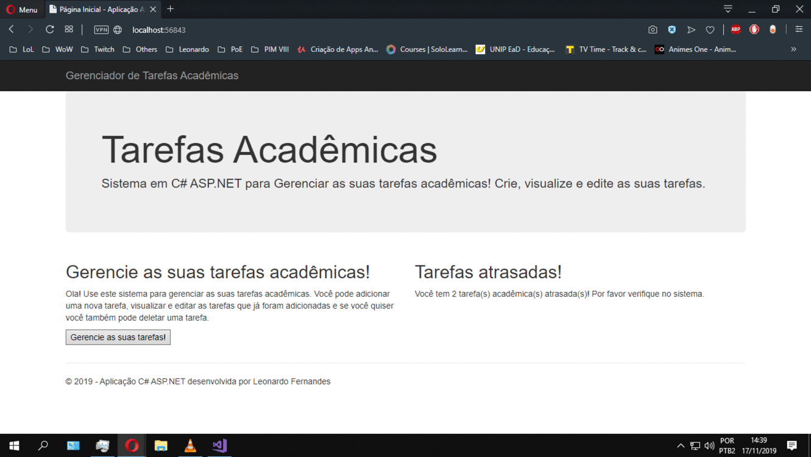

# Gerenciador de Tarefas Acadêmicas
Aplicação web desenvolvida em ASP.NET + C# para trabalho de conclusão do curso de Análise e Desenvolvimento de Sistemas da UNIP

A proposta era criar uma aplicação web que possibilitava o acesso a um Banco de Dados criado com o Microsoft Access e que possibilitava a interação do usuário como inserir novas tarefas, deletar ou editar tarefas existantes e além disso a aplicação deveria mostrar um aviso em tela quando houver uma tarefa acadêmica atrasada.

A aplicação foi desenvolvida utilizando a arquitetura MVC utilizando as tecnologias ASP.NET + C# e possibilita as operações CRUD já citadas.

